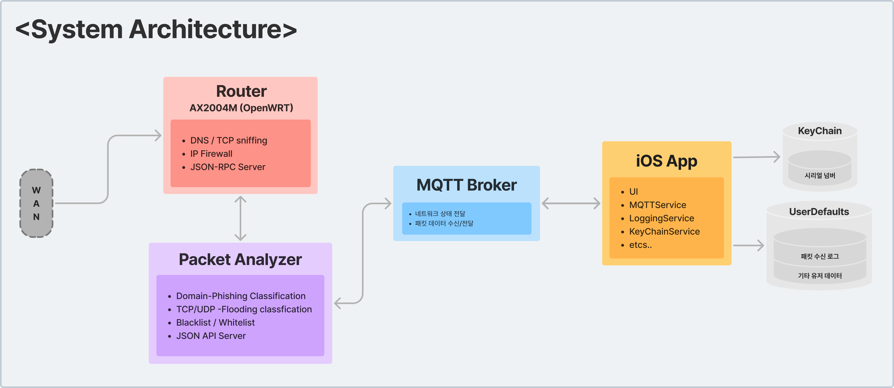

# NetHawk


## Summary
`NetHawk`는 ['24 한밭대학교 컴퓨터공학과 캡스톤디자인](https://github.com/HBNU-SWUNIV/come-capstone24-mobitoa)의  
`엣지 컴퓨팅 기반의 AI 보안 라우터`라는 주제에서 `사용자 인터페이스` 부분을 담당하는 어플입니다.  
주요 개발 개요는 [전체 프로젝트 링크](https://github.com/HBNU-SWUNIV/come-capstone24-mobitoa)를 통해 확인할 수 있습니다.

## App Introduction
`NetHawk`는 다양한 네트워크 공격에 대응하고, 보안 네트워크 환경을 제공하는 `AI 기반 보안 라우터 관리 앱`입니다.  
이 앱은 사용자 라우터와의 연결 및 연결 상태를 모니터링하고, 네트워크 위협으로부터 알림을 받을 수 있도록 설계되었습니다.

## Requirements
- **iOS Deployment Target**: `17.5`
- **Swift Version**: `5.10`
- `패킷 탐지기가 부착된 라우터`
- `OpenWRT 기반 라우터`  
  
## Screenshots
    

`Intro (Splash) Page`
- 앱 진입 초기 화면
  
`Connection Page`
- Serial Number와 Device Alias를 입력하여 장치에 연결
- Internal, External 설정  

`Main Page`
- 장치의 연결 상태(온라인/오프라인) 실시간 표시
- 로그 및 다양한 기능으로 접근 가능한 메인 화면
  
`Stat Page`
- 공격 유형, 공격 받은 디바이스 별 공격 로그 통계 시각화
- 공격 발생 빈도와 취약한 공격에 대한 파악 가능  
 
`Access Page`  
- IP를 기반으로 접근 허용(화이트리스트) 및 차단(블랙리스트) 기능

`Log Page`
- 각 장치에서 발생한 이벤트 로그를 시간순으로 기록 및 표시
- 이벤트 타입과 침입자 IP 주소 등의 상세 정보 표시
  
`Option Page`
- 알림 설정
- Internal, External 전환 기능
- 장치 전환 기능

## Architecture


## Features


`라우터 연동`
- 라우터 고유 식별자인 **S/N(시리얼 넘버)** 와 사용자를 정의할 **Alias(별칭)** 를 입력하여 라우터와 기기를 연동합니다.  
  (실 기기마다 고유 **S/N**이 있고, **Alias**는 사용자가 정하는 구조를 가정.)
- 기 연결된 유저는 자동으로 메인 페이지로 이동합니다.

`실시간 경고 알림`
- **MQTT 서버**로부터 **실시간 비정상 패킷 수신 및 경고 알림**을 수신합니다.

`KeyChain 저장`
- **S/N**, **Alias**를 **KeyChain**에 저장하고, 비정상 패킷 로그 혹은 기타 데이터를 **UserDefaults**에 저장합니다.

`비정상 패킷 통계`
- 다양한 **공격 유형별 통계**를 제공합니다.
- **기기별 공격 받은 통계**를 제공합니다.

`IP 블랙리스트 / 화이트리스트`
- **특정 IP에 대해 차단 혹은 오픈**할 수 있는 기능을 제공합니다.

`Etcs`
- 이외에 **내부망/외부망 스위칭** 기능, **연결 라우터 재설정** 기능 등을 제공합니다.

## Installation
**1. Clone Projects**
```
git clone https://github.com/yourusername/NetHawk.git
```
**2. Open and Build/Run**
~~~ 
open NetHawk.xcodeproj 
~~~


## Code Style Guide
- [Swift Style Guide](https://github.com/StyleShare/swift-style-guide)

## Fonts
- [Intel One Mono](https://github.com/intel/intel-one-mono)


## Contact
✉️ [accc45@outlook.com](mailto:accc45@outlook.com)